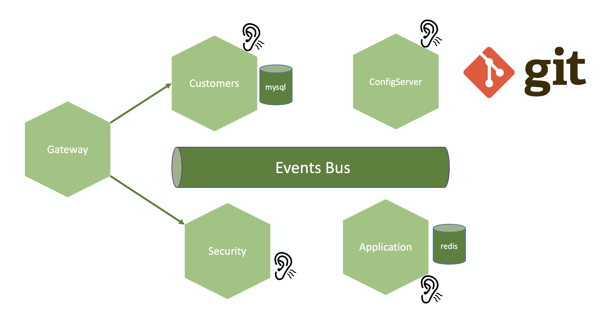

## Config server
1. Arquitectura



1. Generar certificado

    ```shell
    keytool -genkeypair -alias YOU_CONFIG_SERVER_KEY \
       -keyalg RSA -keysize 4096 -sigalg SHA512withRSA \
       -dname 'CN=Config Server,OU=TCI,O=TCI' \
       -keystore config-server.jks \
       -storepass YOU_KEYSTORE_PASSWORD
    ```

1. Configurar remote

    | Varible | Description |
    |:------|:-----------|
    | GIT_URI|Url del repo git|
    | GIT_USER|User conexión |
    | GIT_PWD| Password conexión|
    | KEYSTORE_PWD|-storepass YOU_KEYSTORE_PASSWORD|
    | KEYSTORE_ALIAS|-alias YOU_CONFIG_SERVER_KEY|
    | KEYSTORE_SECRET|-storepass YOU_KEYSTORE_PASSWORD|

1. Recuperar data
    ```shell
    curl http://localhost:8888/clientes/default
    curl http://localhost:8888/lab01/default
    curl http://localhost:8888/lab02/default
    ```

1. Encriptar data
    ```shell
    curl http://localhost:8888/encrypt -H 'Content-Type: text/plain' -d 'data to cypher'
    ```

1. Desencriptar data
    ```shell
    curl http://localhost:8888/decrypt -H 'Content-Type: text/plain' -d "AgCJryWqhAl0n6v6tnejHkYqz1p1O0VWDjpt22h2HK9oZLgilQBjJP+BmO5kA++/YhFKvye1tuP5zAbNe5iLWxaun428A2/cnuhjsqo1AwS37QGi1V3HA3yiR3ugnO/GVM2dd1lf4qnR+crcsEbqsqd7b46NcPgVLdUuCZUPOAiwkaGy3ibSa75VnE9oRNxlJ19b3YkhjalZumonzBj5qyz7BlocZHR+oIslmXM+9u5I2y5MZyIBaiG8B+pq+7kgma5qtPgt0RXWYNCjCT6jA5TtSman+pAK3oXptD+na6Sm4qUgLNzl+704BK3lb8ixEPL7GlDmM0c3GYytArXEMOkfWh8BP0s61BguhDfPpk+n3RfoGgU5mwmkt1D6gkEsB/dloj8EBS/uiFm+Cj4MRUu9mowoi3AMuqJc9bAB6NSVztVtnTPvpon1+tG30IZ9YBL20c081pCM3FxierKBB34HVSMWI1oJ1Jw7Qjj7USCcEk2bV1HIB5wI4bWaCn2NBtgHoPa1oa4WjbNX6Q/XAATZkv1QZkmM4n85GJg9EFPKgEGgWEbIwsULkRYOUK2K6PPPJ9rVF8uQo92g2hBLvFb4IG+R7i/Az6ynvD4e6+T/em1S07GjLHUQ2A71dE6Zkx/7Sdabc3B9xkyVtoVcWO/XB0M3oxdBf0MXmocyrBN3mkqs8USQ1BkrvsZk+dKSmqTQbHXJZecFLi1XF+u3t/Kx"
    ```

1. Escalar réplicas
    ```shell
    docker-compose up --scale lab01=2
    ```

1. Listar clientes
    ```shell
    curl http://localhost:8080/customers
    ```

1. Crear clientes sync
    ```shell
    curl -vvv -d '{"customer": {"nombre": "name1","paterno": "lastname1222","password": "demo"}}' -H "Content-Type: application/json" -H "X-Api-Force-Sync: true" -X POST http://localhost:8080/customers
    ```

    ```shell
    POST http://localhost:8080/customers HTTP/1.1
    content-type: application/json
    X-Api-Force-Sync: true

    {
        "customer": {
            "nombre": "name1",
            "paterno": "lastname1222",
            "password": "demo"
        }
    }
    ```


1. Crear clientes async
    ```shell
    curl -vvv -d '{"customer": {"nombre": "name1","paterno": "lastname1222","password": "demo"}}' -H "Content-Type: application/json" -H "X-Api-Force-Sync: false" -X POST http://localhost:8080/customers
    ```

    ```shell
    POST http://localhost:8080/customers HTTP/1.1
    content-type: application/json
    X-Api-Force-Sync: false

    {
        "customer": {
            "nombre": "name1",
            "paterno": "lastname1222",
            "password": "demo"
        }
    }
    ```

1. Consultar estado
    ```shell
    curl http://localhost:8080/correlations/zlRinbynAQL4vQ3xrQzlzzFI1bZmJ2AwbursBxO9 -H 'Content-Type: text/plain' -d 'data to cypher'
    ```

1. Monitor redis
    ```shell
    docker exec -it <<redis-cli>> /bin/sh
    auth password
    monitor
    ```